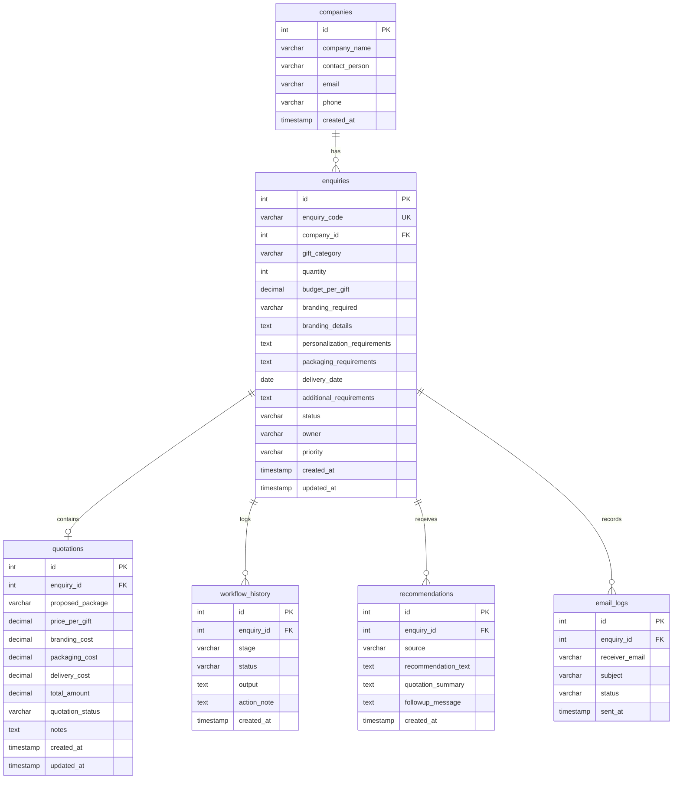

# Database Schema - Paper Plane Corporate Bulk Gift Enquiry Portal

This document defines the MySQL tables, columns, and relationships required for the project.

## Tables Overview

---

## Table Specifications

### 1. `companies`
Stores primary profile details for corporate clients submitting inquiries.

| Field | Data Type | Key / Constraint | Description |
| :--- | :--- | :--- | :--- |
| `id` | INT | PRIMARY KEY, AUTO_INCREMENT | Unique identifier for each company |
| `company_name` | VARCHAR(255) | NOT NULL | Registered name of the company |
| `contact_person` | VARCHAR(255) | NOT NULL | Name of the primary company contact |
| `email` | VARCHAR(255) | NOT NULL | Primary email address for notifications |
| `phone` | VARCHAR(50) | NOT NULL | Direct contact number |
| `created_at` | TIMESTAMP | DEFAULT CURRENT_TIMESTAMP | Date and time the record was created |

### 2. `enquiries`
Contains bulk enquiry details, categories, quantities, budgets, and workflow metadata.

| Field | Data Type | Key / Constraint | Description |
| :--- | :--- | :--- | :--- |
| `id` | INT | PRIMARY KEY, AUTO_INCREMENT | Unique identifier for each enquiry |
| `enquiry_code` | VARCHAR(100) | UNIQUE, NOT NULL | Human-readable tracking ID (e.g., PP-2026-0001) |
| `company_id` | INT | FOREIGN KEY -> `companies(id)` | Link to the company profile |
| `gift_category` | VARCHAR(100) | NOT NULL | Selected category (Employee Kits, Festival Hampers, etc.) |
| `quantity` | INT | NOT NULL | Quantity of units required |
| `budget_per_gift` | DECIMAL(10, 2) | NOT NULL | Budget cap per gift unit |
| `branding_required` | VARCHAR(10) | NOT NULL | Branding required indicator ("Yes" or "No") |
| `branding_details` | TEXT | NULL | Design details, logo positions, dimensions |
| `personalization_requirements` | TEXT | NULL | Customized cards, individual names, custom greeting notes |
| `packaging_requirements` | TEXT | NULL | Special box types, wrapping types, color preferences |
| `delivery_date` | DATE | NOT NULL | Expected date of delivery |
| `additional_requirements` | TEXT | NULL | Any extra remarks or special notes |
| `status` | VARCHAR(50) | DEFAULT 'Enquiry Submitted' | Current process status |
| `owner` | VARCHAR(100) | DEFAULT 'Unassigned' | Internal agent assigned to handle the account |
| `priority` | VARCHAR(50) | DEFAULT 'Medium' | Order priority based on lead-time and bulk scale |
| `created_at` | TIMESTAMP | DEFAULT CURRENT_TIMESTAMP | Submission datetime |
| `updated_at` | TIMESTAMP | DEFAULT CURRENT_TIMESTAMP ON UPDATE CURRENT_TIMESTAMP | Last modification datetime |

### 3. `quotations`
Maintains pricing proposals generated for the corporate enquiry.

| Field | Data Type | Key / Constraint | Description |
| :--- | :--- | :--- | :--- |
| `id` | INT | PRIMARY KEY, AUTO_INCREMENT | Unique identifier |
| `enquiry_id` | INT | FOREIGN KEY -> `enquiries(id)` | Link to parent enquiry |
| `proposed_package` | VARCHAR(255) | NOT NULL | Description of the suggested items bundle |
| `price_per_gift` | DECIMAL(10, 2) | NOT NULL | Proposed item unit cost |
| `branding_cost` | DECIMAL(10, 2) | DEFAULT 0.00 | Fee for logo engraving/branding setups |
| `packaging_cost` | DECIMAL(10, 2) | DEFAULT 0.00 | Special casing or custom box fees |
| `delivery_cost` | DECIMAL(10, 2) | DEFAULT 0.00 | Shipping/freight costs |
| `total_amount` | DECIMAL(10, 2) | NOT NULL | Sum total of all fees: `(price_per_gift * quantity) + branding + packaging + delivery` |
| `quotation_status` | VARCHAR(50) | DEFAULT 'Draft' | Status of proposal ("Draft", "Sent", "Approved", "Rejected") |
| `notes` | TEXT | NULL | Optional explanations, terms, or conditions |
| `created_at` | TIMESTAMP | DEFAULT CURRENT_TIMESTAMP | Creation timestamp |
| `updated_at` | TIMESTAMP | DEFAULT CURRENT_TIMESTAMP ON UPDATE CURRENT_TIMESTAMP | Update timestamp |

### 4. `workflow_history`
Maintains log records tracking status steps across the sales pipeline.

| Field | Data Type | Key / Constraint | Description |
| :--- | :--- | :--- | :--- |
| `id` | INT | PRIMARY KEY, AUTO_INCREMENT | Unique ID |
| `enquiry_id` | INT | FOREIGN KEY -> `enquiries(id)` | Link to enquiry |
| `stage` | VARCHAR(100) | NOT NULL | Current stage in workflow (e.g. Enquiry Submitted, Quotation Preparation) |
| `status` | VARCHAR(50) | NOT NULL | Saved status at that stage |
| `output` | TEXT | NULL | Output details generated |
| `action_note` | TEXT | NULL | Notes describing changes made by agents |
| `created_at` | TIMESTAMP | DEFAULT CURRENT_TIMESTAMP | Time the step occurred |

### 5. `recommendations`
Stores generated package and follow-up suggestions (rule-based or optional Gemini output).

| Field | Data Type | Key / Constraint | Description |
| :--- | :--- | :--- | :--- |
| `id` | INT | PRIMARY KEY, AUTO_INCREMENT | Unique ID |
| `enquiry_id` | INT | FOREIGN KEY -> `enquiries(id)` | Link to enquiry |
| `source` | VARCHAR(50) | NOT NULL | Source engine: `"rule_based"` or `"gemini"` |
| `recommendation_text` | TEXT | NOT NULL | Recommended product line or kit composition |
| `quotation_summary` | TEXT | NOT NULL | Itemized cost estimation breakdown |
| `followup_message` | TEXT | NOT NULL | Pre-written message draft for client communications |
| `created_at` | TIMESTAMP | DEFAULT CURRENT_TIMESTAMP | Timestamp |

### 6. `email_logs`
Audit log recording automated and manual emails sent from the platform.

| Field | Data Type | Key / Constraint | Description |
| :--- | :--- | :--- | :--- |
| `id` | INT | PRIMARY KEY, AUTO_INCREMENT | Unique ID |
| `enquiry_id` | INT | FOREIGN KEY -> `enquiries(id)` | Link to enquiry |
| `receiver_email` | VARCHAR(255) | NOT NULL | Destination email address |
| `subject` | VARCHAR(255) | NOT NULL | Message subject line |
| `status` | VARCHAR(50) | NOT NULL | Status ("Sent", "Failed") |
| `sent_at` | TIMESTAMP | DEFAULT CURRENT_TIMESTAMP | Timestamp when transmission executed |
